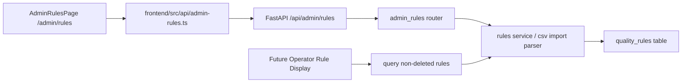

## Context

本变更基于 `proposal.md` 中的 `admin-rules-management` capability。当前系统已有管理员计划管理、成员管理、标注详情页和旧版 `backend/app/routers/admin_rules.py`，但规则模型仍使用 `code/name/description/score/is_active`，不满足本次规则分类、规则内容、文本分值、CSV 批量导入和无启停逻辑的要求。

前端使用 Vite + React + TypeScript + Tailwind CSS + Ant Design 6.x，现有管理员页面复用 `AdminShell`。后端使用 FastAPI + SQLAlchemy + SQLite，启动时通过 `Base.metadata.create_all` 初始化表结构。设计文件位于 `design/`，本次页面设计需引用现有组件库和 CSS token；页面的前端代码实现也优先使用 `frontend/src/components/` 中的组件。前端实现阶段必须执行设计稿 1:1 还原审计。

## Goals / Non-Goals

**Goals:**

- 提供管理员质控规则管理能力：列表、搜索、分页、新增、编辑、删除、CSV 模板下载、CSV 批量导入。
- 将规则字段统一为规则分类、规则内容、分值，其中分类为固定单选枚举，规则内容和分值均按文本处理。
- 支持规则软删除，删除后的规则在管理员规则管理页立即不可见，操作员刷新当前页面后也不可见。
- 前端先以 mock 假数据完成页面与设计验收，再接入真实 API。
- 明确 React Router、FastAPI Router、数据库 schema 和 Pencil 设计文件规划。

**Non-Goals:**

- 不实现规则启用、停用、生效状态或版本冻结。
- 不实现规则审批、发布、灰度、导出、批量编辑、审计日志。
- 不实现规则表达式执行、自动评分或标注结论计算。
- 本期暂不涉及 `design/pages/operator-annotate.pen` 的设计调整，也暂不实现操作员标注页面展示规则的前端代码。
- 不改变计划、导入、成员、报表等既有业务流程。

## Technical Architecture

整体采用现有前后端分离结构：

- 前端：新增 `AdminRulesPage` 作为管理员规则管理入口，使用 mock service 驱动初版 UI 验收；验收通过后替换为 `frontend/src/api/admin-rules.ts` 中的真实 API 调用。
- 后端：重构现有 `admin_rules` router，新增规则 CSV 解析服务，统一从数据库读取当前规则。
- 数据库：规则作为全局配置数据保存，不关联具体计划；删除操作采用软删除，通过 `deleted_at` 标记删除状态。
- 标注详情：本期暂不实现操作员标注页面规则展示代码；后端规则查询仍以未删除规则为准，为后续接入保留清晰边界。

## Frontend Route Plan (React Router)

- `frontend/src/app/App.tsx`
  - Add `/admin/rules`.
  - Protect with `ProtectedRoute role="admin"`.
  - Render `frontend/src/pages/admin/admin-rules-page.tsx`.
- `frontend/src/pages/admin/components/admin-shell.tsx`
  - Change the existing rules nav item from disabled button to `<Link to="/admin/rules">`.
  - Keep `activeKey="rules"` for selected nav state.
- `frontend/src/pages/admin/admin-rules-page.tsx`
  - Page header: title `质控规则`, primary action `新增规则`, secondary action `批量导入`.
  - Filters: keyword search for rule content and category selector.
  - Table: category, content, score, updated time, actions.
  - Drawer or modal form: category radio/select, content textarea, score input text.
  - Import panel/modal: provide CSV template download and file upload in the same batch import flow; after upload, show total/success/failed rows and row-level errors.
- `frontend/src/pages/operator-annotate-page.tsx`
  - No implementation in this change. Do not add rule display UI in this phase.

Mock flow:

- Add `frontend/src/mocks/admin-rules.ts` or page-local mock fixtures for first acceptance.
- Keep rule API function signatures stable during mock stage so real API replacement only changes implementation.
- Mock data must cover all five categories, empty list, long rule content, import success, partial import failure.
- Use existing components under `frontend/src/components/` first for buttons, table, form controls, upload, modal/drawer, empty and feedback states. Add page-local composition only when existing components do not cover the layout.

## Backend Module Plan (FastAPI Router)

- `backend/app/routers/admin_rules.py`
  - `GET /admin/rules`: admin-only paginated list, supports `keyword`, `category`, `page`, `page_size`.
  - `GET /admin/rules/template.csv`: admin-only CSV template download.
  - `POST /admin/rules/import-csv`: admin-only multipart CSV import.
  - `POST /admin/rules`: admin-only create single rule.
  - `PATCH /admin/rules/{rule_id}`: admin-only update category/content/score.
  - `DELETE /admin/rules/{rule_id}`: admin-only soft delete rule by setting `deleted_at`.
- `backend/app/schemas/rule.py`
  - Replace old `code/name/description/is_active` schema with `category/content/score`.
  - Add list, create, patch, import summary, import row error response schemas.
- `backend/app/services/rule_import.py`
  - Parse CSV using standard library `csv`.
  - Validate required headers: `category,content,score`.
  - Validate category is one of the five allowed values.
  - Treat missing required values and category values outside the enum as row-level error items.
  - Treat `score` as string and preserve original text after trimming.
  - Allow duplicate rules; do not check uniqueness by category or content.
  - Return partial failure details without silently dropping invalid rows.

## Database Schema Overview

Use a `quality_rules` table for the target schema. The existing `rules` table and its old model shape are incompatible with the target design; this change completely abandons the old version. Implementation should delete/drop the old database table and remove the old structure definition, clearing all historical rule data.

| Column | Type | Constraint | Notes |
|---|---|---|---|
| `id` | integer | primary key | Rule identifier |
| `category` | varchar(32) | not null, indexed | One of `admission_record`, `first_course_record`, `superior_physician_round`, `daily_course_record`, `discharge_record` |
| `content` | text | not null | 规则内容 |
| `score` | varchar(64) | not null | 文本分值，保留 CSV 原始文本语义 |
| `deleted_at` | datetime | nullable, indexed | Soft delete marker; non-null means deleted |
| `created_by` | integer | nullable foreign key users.id | 创建管理员 |
| `created_at` | datetime | not null | 创建时间 |
| `updated_at` | datetime | not null | 更新时间 |

Indexes:

- `ix_quality_rules_category` on `category`.
- `ix_quality_rules_deleted_at` on `deleted_at`.
- `ix_quality_rules_updated_at` on `updated_at` for stable latest ordering.

No `is_active`, `disabled_at`, `version`, or `effective_at` columns are introduced in this change. Soft delete uses `deleted_at`, not active/inactive state.

## Pencil Design File Plan

- `design/pages/admin-rules.pen`
  - 管理员规则管理列表页。
  - 包含搜索、分类筛选、分页表格、新增/编辑弹窗、软删除确认、批量导入入口、导入面板内的 CSV 模板下载、CSV 上传、导入结果反馈。
- `design/pages/operator-annotate.pen`
  - 本期不调整该文件，不设计操作员标注页规则展示。
- `design/components/data-entry.lib.pen`
  - 复用上传、选择器、输入框、表单组件；如需要 import summary 样式，优先组合现有组件，不新增独立组件库。
- `design/components/data-display.lib.pen`
  - 复用表格、标签、空状态和反馈组件。

Design audit requirements:

- 前端页面完成 mock 流程后，导出或截图与 `design/pages/admin-rules.pen` 对比。
- 审计项目包括布局尺寸、间距、字号、颜色 token、表格列、按钮位置、弹窗内容、空状态、错误状态。
- 发现偏差必须先修复前端，再进入后端开发。

## Decisions

1. 使用固定枚举保存规则分类，而不是自由文本分类。
   - Rationale: 分类范围已由需求限定，固定枚举可以减少导入脏数据并保证筛选一致性。
   - Alternative considered: 自由文本分类。该方案导入灵活，但会产生同义词、错别字和不可控筛选项。

2. 分值按文本保存，而不是数字。
   - Rationale: 需求明确分值为文本，后续可能出现 `5分`、`扣2`、`一票否决` 等非数字表达。
   - Alternative considered: integer/decimal。该方案便于计算，但会提前引入自动评分假设，超出本期范围。

3. 批量导入采用 CSV 模板加服务端逐行校验。
   - Rationale: 当前计划导入已使用 CSV，继续沿用用户认知和后端解析方式。
   - Alternative considered: Excel 上传。该方案对业务友好，但增加依赖和解析复杂度，本期不需要。

4. 删除规则采用软删除，而不是物理删除。
   - Rationale: 删除后页面立即不可见，同时保留数据库记录便于后续排查和潜在恢复。
   - Alternative considered: 物理删除。该方案实现简单，但删除后无法追踪历史操作，不利于管理类数据维护。

5. 前端先 mock 验收，再接后端。
   - Rationale: 本功能有明确页面与导入交互，先完成设计稿还原能降低后端联调阶段的 UI 返工。
   - Alternative considered: 后端先行。该方案接口稳定更早，但容易让页面形态受临时数据结构牵引。

6. 本期不实现操作员标注页规则展示。
   - Rationale: 当前优先交付管理员规则管理闭环和设计稿还原，操作员页面展示规则留到后续变更处理。
   - Alternative considered: 同步实现操作员展示。该方案能形成端到端展示闭环，但会扩大本期设计和前端范围。

## Risks / Trade-offs

- [Risk] 现有 `rules` 表字段与目标 schema 不一致，SQLite 本地环境可能保留旧表结构 → Mitigation: 明确放弃旧版本，删除旧表和旧结构定义，清空历史规则数据后创建 `quality_rules`。
- [Risk] 软删除规则仍可能被旧查询返回 → Mitigation: 所有列表和后续查询默认过滤 `deleted_at is null`，并在后端测试覆盖软删除后不可见。
- [Risk] CSV 导入部分成功可能让管理员误以为全部成功 → Mitigation: 导入响应和 UI 必须显示总行数、成功数、失败数、失败行号与原因。
- [Risk] 文本分值不可用于统计计算 → Mitigation: 明确本期只做展示依据，不做自动评分。
- [Risk] 设计稿与实现偏差影响验收 → Mitigation: mock 验收阶段执行 1:1 对比审计，修复后再进入后端开发。

## Migration Plan

1. 设计阶段：更新 `design/pages/admin-rules.pen`，本期不调整 `design/pages/operator-annotate.pen`。
2. 前端 mock 阶段：实现 `/admin/rules`，完成设计审计。
3. 后端阶段：调整规则 model/schema/router/service，新增 CSV 模板和导入接口。
4. 数据阶段：删除旧 `rules` 表和旧结构定义，清空历史规则数据，创建 `quality_rules` 表。
5. 联调阶段：替换 mock API，验证管理员和操作员权限边界。
6. 部署阶段：通过 docker-compose smoke test 验证登录、规则列表、批量导入、软删除后不可见。

Rollback:

- 前端可移除 `/admin/rules` 路由入口。
- 后端可撤销新 router 注册；数据库保留 `quality_rules` 表不影响既有计划和标注流程。

## Open Questions

- Resolved: 删除规则后，在管理员规则管理页面立即不可见；操作员刷新当前页面后立即不可见。
- Resolved: CSV 批量导入允许重复，不做重复校验、覆盖或合并。
- Resolved: 规则列表支持按照规则内容进行模糊搜索，支持按照规则类型筛选，不对分值做搜索或筛选。
