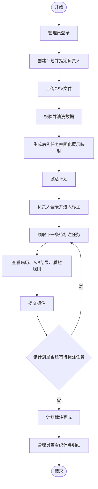
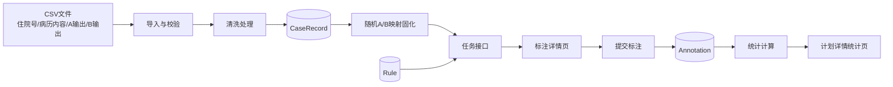
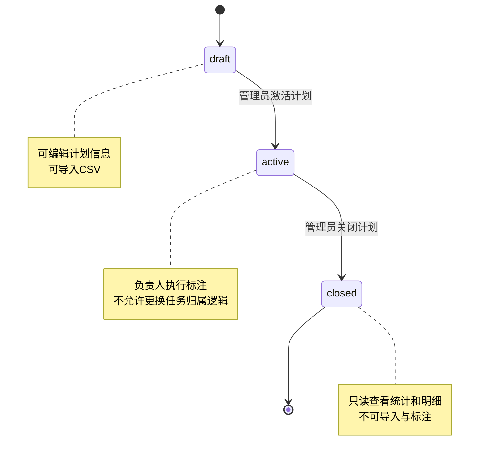
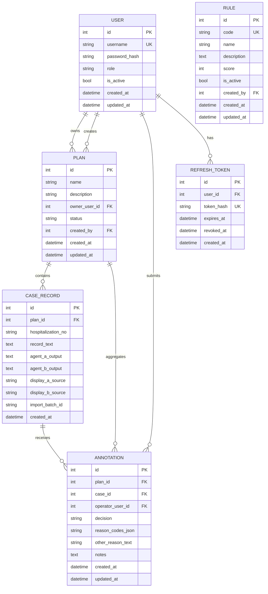

# OpenSpec 规范：病历质控标注系统

## 1. 项目概述

### 1.1 目标

构建面向医院质控科的病历质控标注平台，用于对比不同 AI 病历质控智能体输出结果并进行人工标注，沉淀可追溯专家判断，支撑后续模型优化与质控规则迭代。

### 1.2 范围（In Scope）

- 基于账号密码登录的单系统访问（含 access token + refresh token）。
- 管理员创建标注计划、上传 CSV 数据、查看标注结果与统计、管理成员、管理质控规则（展示依据）。
- 操作员执行标注任务并提交结果。
- 标注工作台三栏对比（病历内容、结果 A、结果 B），支持结论单选、标注原因多选、备注。
- A/B 展示随机且对单条样本持久固定。
- 数据清洗、导入校验、结果汇总统计。

### 1.3 不包含（Out of Scope）

- 用户注册、找回密码、短信/邮箱验证码。
- 多租户隔离、复杂 RBAC、细粒度字段级权限。
- 第三方单点登录（LDAP/OAuth/SAML）。
- 自动训练、自动规则生成、模型部署与推理服务。
- 审计日志与操作追踪。

---

## 2. 用户角色

| 角色名 | 权限 | 核心操作 |
|---|---|---|
| 管理员（admin） | 系统全局管理权限 | 登录、创建/编辑/关闭标注计划、上传 CSV、查看统计与明细、管理成员、管理质控规则（展示依据） |
| 操作员（operator） | 仅执行本人负责计划的标注任务 | 登录、获取下一条待标注任务、提交标注 |

### 2.1 首期预置账号

- 管理员：`admin / admin`
- 操作员：`czy / czy`

### 2.2 角色边界

- 管理员不可代替操作员提交标注结果。
- 操作员不可创建计划、上传数据、管理成员、管理质控规则。

---

## 3. 功能模块清单

### 3.1 认证登录模块

- 子功能
  - 账号密码登录。
  - access token 签发与 refresh token 自动刷新。
  - 当前用户信息查询。
- 验收标准
  - 正确账号密码登录成功并返回 access token、refresh token、角色信息。
  - 错误账号或密码返回 `401`，不暴露具体字段错误。
  - 过期 access token 可通过 refresh token 换新；无效 refresh token 返回 `401`。
  - 未携带 token 调用受保护接口返回 `401`。
  - 角色不匹配调用接口返回 `403`。

### 3.2 标注计划管理模块（管理员）

- 子功能
  - 创建计划：名称、说明、负责人（操作员）。
  - 计划列表/详情查看。
  - 计划状态管理（`draft`/`active`/`closed`）。
- 验收标准
  - 创建计划时名称必填，负责人必须是存在且有效的操作员账号。
  - 每个计划必须绑定 1 名负责人。
  - 计划激活后，该计划全部任务仅由该负责人完成。
  - 计划关闭后不可导入新样本，操作员不可继续提交标注。

### 3.3 CSV 导入与数据清洗模块（管理员）

- 子功能
  - 上传 CSV（创建计划时上传或计划详情页上传）。
  - 模板校验、字段映射、重复检测。
  - 文本清洗与入库（仅存清洗后内容）。
  - 为每条样本生成并持久化 A/B 映射。
- 验收标准
  - 仅接受 `.csv` 文件；空文件或解析失败返回 `400`。
  - 模板固定为四列：`住院号`、`病历内容`、`智能体A输出`、`智能体B输出`。
  - 本期不补充其他业务字段。
  - 同一计划内 `住院号` 重复行默认跳过并记录跳过数。
  - 导入成功返回总行数、成功数、跳过数、失败数及失败原因摘要。
  - 每条成功样本均生成固定 A/B 映射，刷新页面后不变化。

### 3.4 标注执行模块（操作员）

- 子功能
  - 获取下一条待标注任务。
  - 三栏展示：病历内容 / 结果 A / 结果 B（Markdown + HTML 标签识别渲染）。
  - 标注详情页展示全局生效质控规则（仅阅读，用于对比时参考依据）。
  - 提交标注：结论单选、原因多选（固定值）、其他原因文本、备注选填。
- 验收标准
  - 操作员仅能领取自己负责计划的任务，跨计划或非负责人访问返回 `403`。
  - 无任务时返回 `null`（200）并显示“当前计划已完成”。
  - 结论枚举：`A_BETTER`、`B_BETTER`、`BOTH_BAD`、`BOTH_GOOD`。
  - 标注原因固定枚举：`NO_HIT_ERROR_RULE`、`NO_MISSING_RULE`、`NO_OVER_QC`、`OTHER`（可多选，不可为空）。
  - 当选择 `OTHER` 时，`other_reason_text` 必填；未选择 `OTHER` 时该字段为空。
  - 同一条样本同一操作员只能成功提交一次，重复提交返回 `409`。

### 3.5 结果统计与明细模块（管理员）

- 子功能
  - 计划层统计：总量、已标注、待标注、完成率。
  - 决策分布统计。
  - 标注原因分布统计（固定枚举口径）。
  - 标注明细查询（分页/条件过滤）。
- 验收标准
  - 统计与明细口径一致（同一时刻汇总值可由明细复算）。
  - 明细支持按计划、操作员、结论、日期范围过滤。
  - 本期不提供导出 CSV/Excel/打印功能。

### 3.6 成员管理模块（管理员）

- 子功能
  - 查看成员列表。
  - 新增/禁用成员（仅 admin/operator）。
  - 重置成员密码（管理员执行）。
- 验收标准
  - 用户名全局唯一，重复创建返回 `409`。
  - 禁用成员后立即无法登录。
  - 管理员账号至少保留 1 个有效用户。

### 3.7 质控规则管理模块（管理员）

- 子功能
  - 维护“质控规则”列表（增删改查）。
  - 质控规则包含规则名称、规则描述、分值。
  - 全部计划统一遵守并展示当前生效质控规则。
- 验收标准
  - 规则可按名称模糊搜索并分页展示。
  - 标注详情页始终展示规则最新版本（本期不做规则版本冻结）。

### 3.8 核心业务流程

#### 3.8.1 业务流程流转图



#### 3.8.2 数据流转图



#### 3.8.3 状态机图（计划）



### 3.9 页面清单

| 页面 | 路由 | 角色 | 主要内容 | 关键操作 | 验收标准 |
|---|---|---|---|---|---|
| 登录页 | `/login` | 全部 | 账号、密码输入框 | 登录、自动跳转 | 登录成功后根据角色跳转；失败提示统一错误信息 |
| 计划列表页 | `/admin/plans` | 管理员 | 计划列表、状态筛选、负责人筛选 | 新建计划、进入详情、修改状态 | 可分页检索；状态与数量显示正确 |
| 计划详情页 | `/admin/plans/:id` | 管理员 | 计划基本信息、导入结果、统计、标注明细 | 上传CSV、查看统计、筛选明细 | 导入反馈和统计口径一致；不可导出 |
| 成员管理页 | `/admin/users` | 管理员 | 用户列表、角色、状态 | 新增用户、禁用用户、重置密码 | 用户状态变更即时生效 |
| 规则管理页 | `/admin/rules` | 管理员 | 质控规则列表与编辑区 | 新增/编辑/删除规则 | 列表可搜索分页；详情页可看到最新规则 |
| 标注详情页 | `/operator/plans/:id/annotate` | 操作员 | 病历内容、A/B输出、质控规则、标注表单 | 提交标注、加载下一条 | 仅负责人可访问；提交后进入下一条或完成提示 |

---

## 4. 数据模型

### 4.1 实体与字段

#### User

- `id` INTEGER PK
- `username` TEXT UNIQUE NOT NULL
- `password_hash` TEXT NOT NULL
- `role` TEXT NOT NULL (`admin`/`operator`)
- `is_active` BOOLEAN NOT NULL DEFAULT true
- `created_at` DATETIME NOT NULL
- `updated_at` DATETIME NOT NULL

#### Plan

- `id` INTEGER PK
- `name` TEXT NOT NULL
- `description` TEXT NULL
- `owner_user_id` INTEGER NOT NULL FK -> User.id
- `status` TEXT NOT NULL (`draft`/`active`/`closed`)
- `created_by` INTEGER FK -> User.id
- `created_at` DATETIME NOT NULL
- `updated_at` DATETIME NOT NULL

#### CaseRecord

- `id` INTEGER PK
- `plan_id` INTEGER FK -> Plan.id
- `hospitalization_no` TEXT NOT NULL
- `record_text` TEXT NOT NULL
- `agent_a_output` TEXT NOT NULL
- `agent_b_output` TEXT NOT NULL
- `display_a_source` TEXT NOT NULL (`agent_a`/`agent_b`)
- `display_b_source` TEXT NOT NULL (`agent_a`/`agent_b`)
- `import_batch_id` TEXT NOT NULL
- `created_at` DATETIME NOT NULL
- 约束：`UNIQUE(plan_id, hospitalization_no)`

#### Annotation

- `id` INTEGER PK
- `plan_id` INTEGER FK -> Plan.id
- `case_id` INTEGER FK -> CaseRecord.id
- `operator_user_id` INTEGER FK -> User.id
- `decision` TEXT NOT NULL (`A_BETTER`/`B_BETTER`/`BOTH_BAD`/`BOTH_GOOD`)
- `reason_codes` TEXT NOT NULL（JSON 数组，元素取值：`NO_HIT_ERROR_RULE`/`NO_MISSING_RULE`/`NO_OVER_QC`/`OTHER`）
- `other_reason_text` TEXT NULL（仅当 `reason_codes` 包含 `OTHER` 时必填）
- `notes` TEXT NULL
- `created_at` DATETIME NOT NULL
- `updated_at` DATETIME NOT NULL
- 约束：`UNIQUE(case_id, operator_user_id)`

#### Rule

- `id` INTEGER PK
- `code` TEXT UNIQUE NOT NULL
- `name` TEXT NOT NULL
- `description` TEXT NULL
- `score` INTEGER NOT NULL DEFAULT 0
- `is_active` BOOLEAN NOT NULL DEFAULT true
- `created_by` INTEGER FK -> User.id
- `created_at` DATETIME NOT NULL
- `updated_at` DATETIME NOT NULL

#### RefreshToken

- `id` INTEGER PK
- `user_id` INTEGER FK -> User.id
- `token_hash` TEXT UNIQUE NOT NULL
- `expires_at` DATETIME NOT NULL
- `revoked_at` DATETIME NULL
- `created_at` DATETIME NOT NULL

### 4.2 Mermaid ERD



---

## 5. API 契约

统一前缀：`/api`

### 5.1 认证

#### POST `/auth/login`

- Request Body

```json
{
  "username": "admin",
  "password": "admin"
}
```

- Response 200

```json
{
  "access_token": "string",
  "token_type": "bearer",
  "expires_in": 3600,
  "refresh_token": "string",
  "refresh_expires_in": 604800,
  "user": {
    "id": 1,
    "username": "admin",
    "role": "admin"
  }
}
```

- 错误码：`401 AUTH_INVALID_CREDENTIALS`

#### POST `/auth/refresh`

- Request Body

```json
{
  "refresh_token": "string"
}
```

- Response 200

```json
{
  "access_token": "string",
  "token_type": "bearer",
  "expires_in": 3600,
  "refresh_token": "string",
  "refresh_expires_in": 604800
}
```

- 错误码：`401 AUTH_INVALID_REFRESH_TOKEN`、`401 AUTH_REFRESH_TOKEN_EXPIRED`

#### GET `/auth/me`

- Header: `Authorization: Bearer <token>`
- Response 200

```json
{
  "id": 1,
  "username": "admin",
  "role": "admin",
  "is_active": true
}
```

- 错误码：`401 AUTH_UNAUTHORIZED`

### 5.2 计划管理（管理员）

#### POST `/admin/plans`

- Request Body

```json
{
  "name": "2026Q2 质控对比评审",
  "description": "神经内科首期评审",
  "owner_user_id": 2
}
```

- Response 201

```json
{
  "id": 12,
  "name": "2026Q2 质控对比评审",
  "description": "神经内科首期评审",
  "owner_user_id": 2,
  "status": "draft",
  "created_at": "2026-04-22T10:00:00Z"
}
```

- 错误码：`400 VALIDATION_ERROR`、`403 FORBIDDEN`

#### GET `/admin/plans`

- Query: `status`、`owner_user_id`、`page`、`page_size`
- Response 200

```json
{
  "items": [
    {
      "id": 12,
      "name": "2026Q2 质控对比评审",
      "status": "active",
      "owner_user_id": 2,
      "total_cases": 120,
      "annotated_cases": 35
    }
  ],
  "total": 1,
  "page": 1,
  "page_size": 20
}
```

#### PATCH `/admin/plans/{plan_id}`

- Request Body

```json
{
  "name": "2026Q2 质控对比评审-修订",
  "description": "可选",
  "owner_user_id": 2,
  "status": "active"
}
```

- Response 200: 返回更新后的计划对象
- 错误码：`404 PLAN_NOT_FOUND`、`409 PLAN_STATUS_CONFLICT`

### 5.3 CSV 导入（管理员）

#### POST `/admin/plans/{plan_id}/import-csv`

- Content-Type: `multipart/form-data`
- Form 字段：`file=<csv>`
- Response 200

```json
{
  "plan_id": 12,
  "import_batch_id": "20260422_100011_ab12",
  "total_rows": 200,
  "success_rows": 180,
  "skipped_rows": 15,
  "failed_rows": 5,
  "errors": [
    {
      "row": 17,
      "code": "CSV_REQUIRED_COLUMN_MISSING",
      "message": "缺少字段: 智能体B输出"
    }
  ]
}
```

- 错误码：`400 CSV_INVALID_TEMPLATE`、`400 CSV_PARSE_ERROR`、`404 PLAN_NOT_FOUND`、`409 PLAN_CLOSED`

### 5.4 操作员任务

#### GET `/operator/tasks/next?plan_id={id}`

- 说明：仅计划负责人可调用。
- Response 200（有任务）

```json
{
  "case_id": 998,
  "plan_id": 12,
  "hospitalization_no": "ZY20260001",
  "record_text": "...",
  "output_a": "...markdown/html...",
  "output_b": "...markdown/html...",
  "quality_rules": [
    {
      "id": 11,
      "name": "主诉不得超过20字",
      "description": "主诉字段内容长度需不超过20个汉字",
      "score": 5
    }
  ],
  "display_mapping": {
    "A": "agent_a",
    "B": "agent_b"
  }
}
```

- Response 200（无任务）

```json
null
```

- 错误码：`403 FORBIDDEN`、`403 PLAN_NOT_ASSIGNED_TO_OPERATOR`、`404 PLAN_NOT_FOUND`

#### POST `/operator/tasks/{case_id}/annotate`

- Request Body

```json
{
  "decision": "A_BETTER",
  "reason_codes": ["NO_HIT_ERROR_RULE", "NO_MISSING_RULE"],
  "other_reason_text": null,
  "notes": "A 对抗凝风险提示更完整"
}
```

- Response 201

```json
{
  "annotation_id": 501,
  "case_id": 998,
  "operator_user_id": 2,
  "decision": "A_BETTER",
  "reason_codes": ["NO_HIT_ERROR_RULE", "NO_MISSING_RULE"],
  "other_reason_text": null,
  "notes": "A 对抗凝风险提示更完整",
  "created_at": "2026-04-22T10:20:12Z"
}
```

- 错误码：`400 VALIDATION_ERROR`、`403 FORBIDDEN`、`404 CASE_NOT_FOUND`、`409 ANNOTATION_ALREADY_EXISTS`

### 5.5 统计与明细（管理员）

#### GET `/admin/plans/{plan_id}/stats`

- Response 200

```json
{
  "plan_id": 12,
  "total_cases": 180,
  "annotated_cases": 120,
  "pending_cases": 60,
  "completion_rate": 0.6667,
  "decision_distribution": {
    "A_BETTER": 60,
    "B_BETTER": 30,
    "BOTH_BAD": 20,
    "BOTH_GOOD": 10
  },
  "reason_distribution": [
    {"reason_code": "NO_HIT_ERROR_RULE", "reason_name": "无命中错误规则", "count": 55},
    {"reason_code": "NO_MISSING_RULE", "reason_name": "无遗漏规则", "count": 72},
    {"reason_code": "NO_OVER_QC", "reason_name": "无过度质控", "count": 31},
    {"reason_code": "OTHER", "reason_name": "其他", "count": 8}
  ]
}
```

#### GET `/admin/plans/{plan_id}/annotations`

- Query: `operator_user_id`、`decision`、`start_date`、`end_date`、`page`、`page_size`
- Response 200

```json
{
  "items": [
    {
      "annotation_id": 501,
      "case_id": 998,
      "hospitalization_no": "ZY20260001",
      "operator": "czy",
      "decision": "A_BETTER",
      "reasons": ["无命中错误规则", "无遗漏规则"],
      "other_reason_text": null,
      "notes": "A 对抗凝风险提示更完整",
      "created_at": "2026-04-22T10:20:12Z"
    }
  ],
  "total": 1,
  "page": 1,
  "page_size": 20
}
```

### 5.6 成员管理（管理员）

#### GET `/admin/users`

- Response 200: 用户列表

#### POST `/admin/users`

- Request Body

```json
{
  "username": "operator_01",
  "password": "plain_or_temp_password",
  "role": "operator"
}
```

- Response 201: 新建用户
- 错误码：`409 USERNAME_ALREADY_EXISTS`

#### PATCH `/admin/users/{user_id}`

- Request Body

```json
{
  "is_active": false,
  "password": "new_password"
}
```

- Response 200: 更新后用户

### 5.7 质控规则管理（管理员）

#### GET `/admin/rules`

- Response 200: 规则列表

#### POST `/admin/rules`

- Request Body

```json
{
  "code": "RULE_CHIEF_COMPLAINT_MAX_20",
  "name": "主诉不得超过20字",
  "description": "主诉字段内容长度需不超过20个汉字",
  "score": 5,
  "is_active": true
}
```

- Response 201: 新建规则

#### PATCH `/admin/rules/{rule_id}`

- Request Body

```json
{
  "name": "主诉不得超过20字（修订）",
  "description": "可选",
  "score": 5,
  "is_active": true
}
```

- Response 200: 更新后规则

---

## 6. 非功能性需求

### 6.1 认证方式

- 使用 `Bearer Token` 鉴权。
- 支持 `refresh token` 自动刷新 access token。
- 密码以哈希形式存储（推荐 `bcrypt`）。
- 当前阶段不定义复杂度、长度、锁定等密码策略。

### 6.2 性能要求

- 本期暂不设置并发与增长扩展目标。
- 本期以功能正确性和流程闭环为优先。
- 推荐基线：在单机 SQLite 环境下，常规查询和提交接口应保持可用且无明显阻塞。

### 6.3 权限矩阵

| 功能 | 管理员 | 操作员 |
|---|---|---|
| 登录 | ✅ | ✅ |
| Token 刷新 | ✅ | ✅ |
| 查看当前用户信息 | ✅ | ✅ |
| 创建/编辑/关闭计划 | ✅ | ❌ |
| 上传 CSV | ✅ | ❌ |
| 获取下一条任务 | ❌ | ✅（仅本人负责计划） |
| 提交标注 | ❌ | ✅（仅本人负责计划） |
| 查看统计与标注明细 | ✅ | ❌ |
| 成员管理 | ✅ | ❌ |
| 质控规则管理（展示依据） | ✅ | ❌ |

### 6.4 技术与部署约束

- 前端：React + TypeScript。
- 后端：FastAPI（Python）。
- 数据库：SQLite。
- 本地调试：Conda 环境 `aicompare`。
- 部署：Docker + docker-compose。
