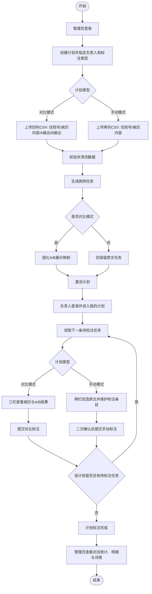
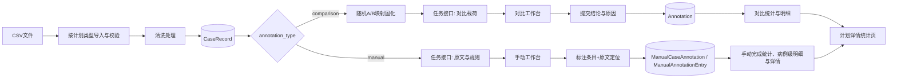
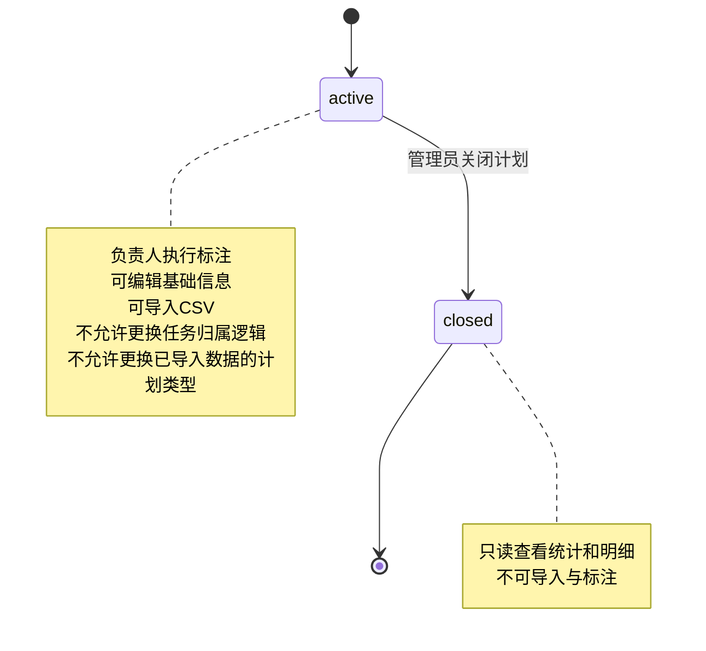
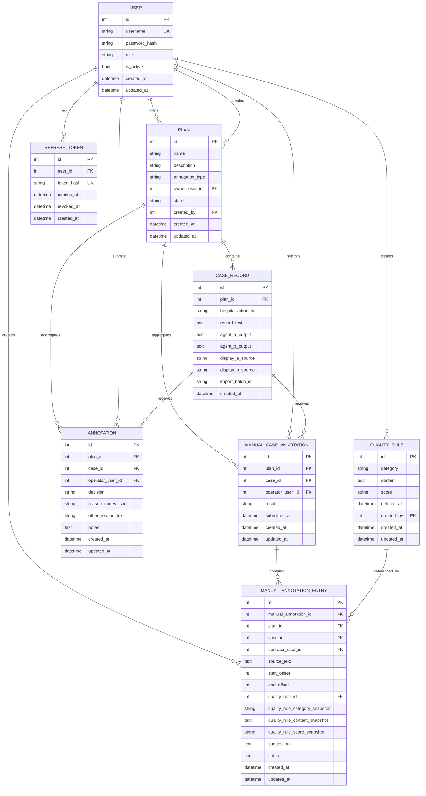

# OpenSpec 规范：病历质控标注平台

## 1. 项目概述

### 1.1 目标

构建面向医院质控科的病历质控标注平台，支持管理员按计划选择标注类型，并支持操作员在不同工作台内完成质控标注。平台当前包含两类计划：

- 对比模式（comparison）：对比不同 AI 病历质控智能体输出结果，沉淀专家对 A/B 结果的判断。
- 手动模式（manual）：基于病历原文由标注员手动圈选问题片段、选择质控规则并填写修改建议，沉淀可追溯的人工质控结果。

### 1.2 范围（In Scope）

- 基于账号密码登录的单系统访问（含 access token + refresh token）。
- 管理员创建标注计划时选择标注类型：`comparison`（对比模式）或 `manual`（手动模式）。
- 管理员按计划类型上传 CSV 数据、查看对应统计、病例级标注明细和单病例标注详情，管理成员、管理质控规则（展示依据）。
- 对比模式沿用三栏对比工作台（病历内容、结果 A、结果 B），支持结论单选、标注原因多选、备注；A/B 展示随机且对单条样本持久固定。
- 手动模式使用两栏标注工作台：左侧展示病历原文并支持划选高亮，右侧展示手动标注条目卡片。
- 手动标注条目包含原文片段（只读）、质控规则（单选）、修改建议（必填）、备注（选填）；后端记录原文定位信息用于高亮和卡片布局，但定位数值不在表单或明细列表中展示。
- 操作员可在未提交前新增、查看、编辑、删除手动标注条目；提交后该病例不可再新增或修改质控建议。
- 手动模式允许以 `no_issue` 完成一份病例，即标注员确认该病例文书未触发任何质控规则。
- 管理员可在手动模式下查看病例级聚合明细，并进入单病例标注详情，以只读工作台视图或列表视图审阅该病例下的全部问题条目。
- 数据清洗、导入校验、任务分发、结果汇总统计和标注明细查询。

### 1.3 不包含（Out of Scope）

- 用户注册、找回密码、短信/邮箱验证码。
- 多租户隔离、复杂 RBAC、细粒度字段级权限。
- 第三方单点登录（LDAP/OAuth/SAML）。
- 自动训练、自动规则生成、模型部署与推理服务。
- 审计日志与操作追踪。
- 本期不支持已提交手动标注的再次编辑或重提。
- 本期不提供手动模式的复杂统计口径、导出 CSV/Excel 或打印功能。

---

## 2. 用户角色

| 角色名 | 权限 | 核心操作 |
|---|---|---|
| 管理员（admin） | 系统全局管理权限 | 登录、创建/编辑/关闭标注计划、上传 CSV、查看统计、明细与手动标注详情、管理成员、管理质控规则（展示依据） |
| 操作员（operator） | 仅执行本人负责计划的标注任务 | 登录、获取下一条待标注任务、提交标注 |

### 2.1 首期预置账号

- 管理员：`admin / admin`
- 操作员：`czy / czy`

### 2.2 角色边界

- 管理员不可代替操作员提交标注结果。
- 操作员不可创建计划、上传数据、管理成员、管理质控规则。

---

## 3. 功能模块清单

### 3.1 认证登录模块

- 子功能
  - 账号密码登录。
  - access token 签发与 refresh token 自动刷新。
  - 当前用户信息查询。
- 验收标准
  - 正确账号密码登录成功并返回 access token、refresh token、角色信息。
  - 错误账号或密码返回 `401`，不暴露具体字段错误。
  - 过期 access token 可通过 refresh token 换新；无效 refresh token 返回 `401`。
  - 未携带 token 调用受保护接口返回 `401`。
  - 角色不匹配调用接口返回 `403`。

### 3.2 标注计划管理模块（管理员）

- 子功能
  - 创建计划：名称、说明、负责人（操作员）、标注类型。
  - 标注类型：`comparison`（对比模式）或 `manual`（手动模式），默认沿用 `comparison`。
  - 计划列表/详情查看，并展示计划标注类型。
  - 计划状态管理（`active`/`closed`）。
- 验收标准
  - 创建计划时名称必填，负责人必须是存在且有效的操作员账号。
  - 每个计划必须绑定 1 名负责人。
  - 计划类型创建后不可在已导入数据的计划中随意切换，避免数据模板和任务语义不一致。
  - 计划创建并导入有效样本后进入进行中状态，该计划全部任务仅由该负责人完成。
  - 计划关闭后不可导入新样本，操作员不可继续提交标注。

### 3.3 CSV 导入与数据清洗模块（管理员）

- 子功能
  - 上传 CSV（创建计划时上传或计划详情页上传）。
  - 根据计划标注类型执行模板校验、字段映射、重复检测。
  - 文本清洗与入库（仅存清洗后内容）。
  - 对比模式为每条样本生成并持久化 A/B 映射。
  - 手动模式仅导入住院号与病历内容，不要求提供智能体输出。
- 验收标准
  - 仅接受 `.csv` 文件；空文件或解析失败返回 `400`。
  - 对比模式模板固定为四列：`住院号`、`病历内容`、`智能体A输出`、`智能体B输出`。
  - 手动模式模板固定为两列：`住院号`、`病历内容`。
  - 本期不补充其他业务字段。
  - 同一计划内 `住院号` 重复行默认跳过并记录跳过数。
  - 导入成功返回总行数、成功数、跳过数、失败数及失败原因摘要。
  - 对比模式每条成功样本均生成固定 A/B 映射，刷新页面后不变化。
  - 手动模式导入后的样本不生成 A/B 映射，也不展示智能体输出区域。

### 3.4 标注执行模块（操作员）

- 子功能
  - 在我的标注计划列表中查看每个计划的标注类型。
  - 获取下一条待标注任务。
  - 对比模式三栏展示：病历内容 / 结果 A / 结果 B（Markdown + HTML 标签识别渲染）。
  - 对比模式提交标注：结论单选、原因多选（固定值）、其他原因文本、备注选填。
  - 手动模式两栏展示：左侧病历原文与质控规则 popover，右侧手动标注条目卡片。
  - 手动模式支持划选病历原文后创建标注条目；“标注”浮层跟随划选结束位置，取消划选后消失，新建表单在无视觉遮挡时与所选原文片段上边沿对齐，右侧面板自动滚动到新建表单位置。
  - 手动模式条目表单包含原文片段（只读）、质控规则（按规则类型分组单选并支持规则内容搜索）、修改建议（必填）、备注（选填）。
  - 手动模式记录原文定位信息，用于左侧黄色/选中浅红高亮、右侧卡片纵向对齐和左右两栏联动滚动；定位信息不展示、不允许编辑。
  - 手动模式未提交前可对同一病例的多条标注条目进行新增、查看、编辑、删除；编辑表单在原卡片位置替换展示。
  - 手动模式提交时统一二次确认；提交后不可再新增、编辑或删除该病例的质控条目。
- 验收标准
  - 操作员仅能领取自己负责计划的任务，跨计划或非负责人访问返回 `403`。
  - 无任务时返回 `null`（200）并显示“当前计划已完成”。
  - 对比模式结论枚举：`A_BETTER`、`B_BETTER`、`BOTH_BAD`、`BOTH_GOOD`。
  - 标注原因固定枚举：`NO_HIT_ERROR_RULE`、`NO_MISSING_RULE`、`NO_OVER_QC`、`OTHER`（可多选，不可为空）。
  - 当选择 `OTHER` 时，`other_reason_text` 必填；未选择 `OTHER` 时该字段为空。
  - 手动模式提交时如果存在 N 条质控问题，弹窗文案为：`当前病历已标记{N}条质控问题，是否确认提交？提交后将不能新增/修改质控建议`。
  - 手动模式提交时如果不存在质控问题，弹窗文案为：`当前病历未标记质控问题，是否确认提交？提交后将不能新增/修改质控建议`。
  - 手动模式左右两栏共享同一纵向画布语义；滚动任一侧时另一侧同步滚动，点击右侧标注条目时左侧自动定位到对应原文上下文。
  - 手动模式标注条目默认态为灰色边框，hover 态为蓝色边框，选中态为稳定蓝色边框和浅蓝底色；选中后对应原文片段为浅红高亮，点击空白区域后退出选中态。
  - 手动模式 `has_issues` 提交必须包含至少 1 条标注条目；`no_issue` 提交必须不包含标注条目。
  - 同一条样本同一操作员只能成功提交一次，重复提交返回 `409`。

### 3.5 结果统计与明细模块（管理员）

- 子功能
  - 计划层统计：总量、已标注、待标注、完成率。
  - 对比模式提供决策分布统计和标注原因分布统计（固定枚举口径）。
  - 手动模式首期提供完成情况统计，可包含有问题/无问题完成数量。
  - 对比模式标注明细查询（分页/条件过滤）。
  - 手动模式标注明细查询按住院号/病例完成记录聚合展示，一份住院病历即使包含多条质控问题也只展示一行。
  - 手动模式标注明细列表包含住院号、操作员、完成状态/结果、问题数、病例完整提交时间和查看详情入口，不展示原文片段、质控规则、修改建议、备注或 offset。
  - 手动模式单病例标注详情支持两种视图：默认只读工作台视图，以及按问题条目展示的列表视图。
  - 管理员只读工作台视图复用操作员手动工作台的两栏结构，左侧展示病历原文黄色高亮，右侧展示同高度标注结果卡片；不可新增、编辑、删除或提交。
  - 管理员详情列表视图按问题条目展示病历原文、质控规则、修改建议、标注时间；标注时间为创建该问题条目卡片的时间，首期不提供详情内搜索筛选。
- 验收标准
  - 统计与明细口径一致（同一时刻汇总值可由明细复算）。
  - 对比模式明细支持按计划、操作员、结论、日期范围过滤。
  - 手动模式明细支持按操作员、标注日期过滤；标注日期按病例完整提交时间计算。
  - 手动模式明细列表不展示原文定位 offset，但后端必须保存定位信息以支持操作员工作台和管理员只读工作台的高亮与卡片布局。
  - `no_issue` 完成记录在明细列表中展示为一行病例级完成记录，问题数为 0；进入详情后工作台视图无高亮和问题卡片，列表视图展示空态。
  - 本期不提供导出 CSV/Excel/打印功能。

### 3.6 成员管理模块（管理员）

- 子功能
  - 查看成员列表。
  - 新增/禁用成员（仅 admin/operator）。
  - 重置成员密码（管理员执行）。
- 验收标准
  - 用户名全局唯一，重复创建返回 `409`。
  - 禁用成员后立即无法登录。
  - 管理员账号至少保留 1 个有效用户。

### 3.7 质控规则管理模块（管理员）

- 子功能
  - 维护“质控规则”列表（增删改查）。
  - 质控规则包含规则分类、规则内容、分值。
  - 支持 CSV 模板下载和 CSV 批量导入。
  - 删除规则采用软删除，删除后的规则在规则管理列表中立即不可见。
- 验收标准
  - 规则可按规则内容模糊搜索并分页展示。
  - 规则可按规则分类筛选，不按分值搜索或筛选。
  - 规则分类固定为：入院病历、首次病程记录、上级医师查房记录、日常病程、出院记录。
  - 分值按文本保存，不引入规则启用、停用或版本冻结。
  - CSV 导入允许重复规则；如果文件中包含缺项或非法分类，整个文件不导入并返回行级错误。

### 3.8 核心业务流程

#### 3.8.1 业务流程流转图



#### 3.8.2 数据流转图



#### 3.8.3 状态机图（计划）



### 3.9 页面清单

| 页面 | 路由 | 角色 | 主要内容 | 关键操作 | 验收标准 |
|---|---|---|---|---|---|
| 登录页 | `/login` | 全部 | 账号、密码输入框 | 登录、自动跳转 | 登录成功后根据角色跳转；失败提示统一错误信息 |
| 计划列表页 | `/admin/plans` | 管理员 | 计划列表、标注类型、状态筛选、负责人筛选 | 新建计划、进入详情、修改状态 | 可分页检索；类型、状态与数量显示正确 |
| 计划详情页 | `/admin/plans/:id` | 管理员 | 计划基本信息、标注类型、导入结果、统计、标注明细 | 上传CSV、查看统计、筛选明细、查看手动标注详情 | 导入模板、统计口径和标注明细随计划类型切换；手动明细按病例级聚合展示；不可导出 |
| 手动标注详情页 | `/admin/plans/:id/annotations/:manualAnnotationId` | 管理员 | 病历原文、问题高亮、只读标注卡片、问题条目列表 | 切换工作台视图/列表视图 | 默认只读工作台视图；列表视图按条目展示病历原文、质控规则、修改建议和条目创建时间 |
| 成员管理页 | `/admin/users` | 管理员 | 用户列表、角色、状态 | 新增用户、禁用用户、重置密码 | 用户状态变更即时生效 |
| 规则管理页 | `/admin/rules` | 管理员 | 质控规则列表与编辑区 | 新增/编辑/删除/批量导入规则 | 列表可按规则内容搜索、按分类筛选并分页 |
| 我的标注计划页 | `/operator/plans` | 操作员 | 本人负责计划、标注类型、完成进度 | 进入标注工作台 | 仅展示本人负责计划；每个计划显示具体标注类型 |
| 对比标注详情页 | `/operator/plans/:id/annotate` | 操作员 | 病历内容、A/B输出、对比标注表单 | 提交标注、加载下一条 | 仅负责人可访问；提交后进入下一条或完成提示 |
| 手动标注详情页 | `/operator/plans/:id/annotate` | 操作员 | 病历原文、质控规则、手动标注条目卡片 | 划选原文、新增/编辑/删除条目、提交病例 | 左右两栏联动滚动；条目卡片与高亮原文上边沿纵向对齐；规则按类型分组选择并支持搜索；提交后二次确认并锁定该病例 |

---

## 4. 数据模型

### 4.1 实体与字段

#### User

- `id` INTEGER PK
- `username` TEXT UNIQUE NOT NULL
- `password_hash` TEXT NOT NULL
- `role` TEXT NOT NULL (`admin`/`operator`)
- `is_active` BOOLEAN NOT NULL DEFAULT true
- `created_at` DATETIME NOT NULL
- `updated_at` DATETIME NOT NULL

#### Plan

- `id` INTEGER PK
- `name` TEXT NOT NULL
- `description` TEXT NULL
- `annotation_type` TEXT NOT NULL DEFAULT `comparison` (`comparison`/`manual`)
- `owner_user_id` INTEGER NOT NULL FK -> User.id
- `status` TEXT NOT NULL (`active`/`closed`)
- `created_by` INTEGER FK -> User.id
- `created_at` DATETIME NOT NULL
- `updated_at` DATETIME NOT NULL

#### CaseRecord

- `id` INTEGER PK
- `plan_id` INTEGER FK -> Plan.id
- `hospitalization_no` TEXT NOT NULL
- `record_text` TEXT NOT NULL
- `agent_a_output` TEXT NULL（对比模式必填，手动模式为空）
- `agent_b_output` TEXT NULL（对比模式必填，手动模式为空）
- `display_a_source` TEXT NULL (`agent_a`/`agent_b`，对比模式生成)
- `display_b_source` TEXT NULL (`agent_a`/`agent_b`，对比模式生成)
- `import_batch_id` TEXT NOT NULL
- `created_at` DATETIME NOT NULL
- 约束：`UNIQUE(plan_id, hospitalization_no)`

#### Annotation（对比模式）

- `id` INTEGER PK
- `plan_id` INTEGER FK -> Plan.id
- `case_id` INTEGER FK -> CaseRecord.id
- `operator_user_id` INTEGER FK -> User.id
- `decision` TEXT NOT NULL (`A_BETTER`/`B_BETTER`/`BOTH_BAD`/`BOTH_GOOD`)
- `reason_codes` TEXT NOT NULL（JSON 数组，元素取值：`NO_HIT_ERROR_RULE`/`NO_MISSING_RULE`/`NO_OVER_QC`/`OTHER`）
- `other_reason_text` TEXT NULL（仅当 `reason_codes` 包含 `OTHER` 时必填）
- `notes` TEXT NULL
- `created_at` DATETIME NOT NULL
- `updated_at` DATETIME NOT NULL
- 约束：`UNIQUE(case_id, operator_user_id)`

#### ManualCaseAnnotation（手动模式病例提交）

- `id` INTEGER PK
- `plan_id` INTEGER FK -> Plan.id
- `case_id` INTEGER FK -> CaseRecord.id
- `operator_user_id` INTEGER FK -> User.id
- `result` TEXT NOT NULL (`has_issues`/`no_issue`)
- `submitted_at` DATETIME NOT NULL（病例完整提交时间；用于手动明细列表的标注时间和日期过滤）
- `created_at` DATETIME NOT NULL
- `updated_at` DATETIME NOT NULL
- 约束：`UNIQUE(case_id, operator_user_id)`

#### ManualAnnotationEntry（手动模式标注条目）

- `id` INTEGER PK
- `manual_annotation_id` INTEGER FK -> ManualCaseAnnotation.id
- `plan_id` INTEGER FK -> Plan.id
- `case_id` INTEGER FK -> CaseRecord.id
- `operator_user_id` INTEGER FK -> User.id
- `source_text` TEXT NOT NULL（原文片段，只读展示）
- `start_offset` INTEGER NOT NULL（基于清洗后 `record_text` 的起始位置，不展示、不允许编辑）
- `end_offset` INTEGER NOT NULL（基于清洗后 `record_text` 的结束位置，不展示、不允许编辑）
- `quality_rule_id` INTEGER FK -> QualityRule.id
- `quality_rule_category_snapshot` TEXT NOT NULL
- `quality_rule_content_snapshot` TEXT NOT NULL
- `quality_rule_score_snapshot` TEXT NOT NULL
- `suggestion` TEXT NOT NULL
- `notes` TEXT NULL
- `created_at` DATETIME NOT NULL（问题条目卡片创建时间；用于管理员详情列表视图的标注时间）
- `updated_at` DATETIME NOT NULL

#### QualityRule

- `id` INTEGER PK
- `category` TEXT NOT NULL（`admission_record`/`first_course_record`/`superior_physician_round`/`daily_course_record`/`discharge_record`）
- `content` TEXT NOT NULL
- `score` TEXT NOT NULL
- `deleted_at` DATETIME NULL
- `created_by` INTEGER FK -> User.id
- `created_at` DATETIME NOT NULL
- `updated_at` DATETIME NOT NULL

#### RefreshToken

- `id` INTEGER PK
- `user_id` INTEGER FK -> User.id
- `token_hash` TEXT UNIQUE NOT NULL
- `expires_at` DATETIME NOT NULL
- `revoked_at` DATETIME NULL
- `created_at` DATETIME NOT NULL

### 4.2 Mermaid ERD



---

## 5. API 契约

统一前缀：`/api`

### 5.1 认证

#### POST `/auth/login`

- Request Body

```json
{
  "username": "admin",
  "password": "admin"
}
```

- Response 200

```json
{
  "access_token": "string",
  "token_type": "bearer",
  "expires_in": 3600,
  "refresh_token": "string",
  "refresh_expires_in": 604800,
  "user": {
    "id": 1,
    "username": "admin",
    "role": "admin"
  }
}
```

- 错误码：`401 AUTH_INVALID_CREDENTIALS`

#### POST `/auth/refresh`

- Request Body

```json
{
  "refresh_token": "string"
}
```

- Response 200

```json
{
  "access_token": "string",
  "token_type": "bearer",
  "expires_in": 3600,
  "refresh_token": "string",
  "refresh_expires_in": 604800
}
```

- 错误码：`401 AUTH_INVALID_REFRESH_TOKEN`、`401 AUTH_REFRESH_TOKEN_EXPIRED`

#### GET `/auth/me`

- Header: `Authorization: Bearer <token>`
- Response 200

```json
{
  "id": 1,
  "username": "admin",
  "role": "admin",
  "is_active": true
}
```

- 错误码：`401 AUTH_UNAUTHORIZED`

### 5.2 计划管理（管理员）

#### POST `/admin/plans`

- Request Body

```json
{
  "name": "2026Q2 病历质控手动标注",
  "description": "神经内科首期评审",
  "owner_user_id": 2,
  "annotation_type": "manual"
}
```

- Response 201

```json
{
  "id": 12,
  "name": "2026Q2 病历质控手动标注",
  "description": "神经内科首期评审",
  "owner_user_id": 2,
  "annotation_type": "manual",
  "status": "active",
  "created_at": "2026-04-22T10:00:00Z"
}
```

- 错误码：`400 VALIDATION_ERROR`、`403 FORBIDDEN`

#### GET `/admin/plans`

- Query: `status`、`owner_user_id`、`annotation_type`、`page`、`page_size`
- Response 200

```json
{
  "items": [
    {
      "id": 12,
      "name": "2026Q2 病历质控手动标注",
      "annotation_type": "manual",
      "status": "active",
      "owner_user_id": 2,
      "total_cases": 120,
      "annotated_cases": 35
    }
  ],
  "total": 1,
  "page": 1,
  "page_size": 20
}
```

#### PATCH `/admin/plans/{plan_id}`

- Request Body

```json
{
  "name": "2026Q2 病历质控手动标注-修订",
  "description": "可选",
  "owner_user_id": 2,
  "status": "active"
}
```

- Response 200: 返回更新后的计划对象
- 约束：已导入数据的计划不得切换 `annotation_type`。
- 错误码：`404 PLAN_NOT_FOUND`、`409 PLAN_STATUS_CONFLICT`

### 5.3 CSV 导入（管理员）

#### POST `/admin/plans/{plan_id}/import-csv`

- Content-Type: `multipart/form-data`
- Form 字段：`file=<csv>`
- 模板说明
  - 对比模式：`住院号,病历内容,智能体A输出,智能体B输出`
  - 手动模式：`住院号,病历内容`
- Response 200

```json
{
  "plan_id": 12,
  "annotation_type": "manual",
  "import_batch_id": "20260422_100011_ab12",
  "total_rows": 200,
  "success_rows": 180,
  "skipped_rows": 15,
  "failed_rows": 5,
  "errors": [
    {
      "row": 17,
      "code": "CSV_REQUIRED_COLUMN_MISSING",
      "message": "缺少字段: 病历内容"
    }
  ]
}
```

- 错误码：`400 CSV_INVALID_TEMPLATE`、`400 CSV_PARSE_ERROR`、`404 PLAN_NOT_FOUND`、`409 PLAN_CLOSED`

### 5.4 操作员任务

#### GET `/operator/tasks/next?plan_id={id}`

- 说明：仅计划负责人可调用。
- Response 200（对比模式有任务）

```json
{
  "case_id": 998,
  "plan_id": 12,
  "annotation_type": "comparison",
  "hospitalization_no": "ZY20260001",
  "record_text": "...",
  "output_a": "...markdown/html...",
  "output_b": "...markdown/html...",
  "quality_rules": [
    {
      "id": 11,
      "category": "admission_record",
      "content": "主诉字段内容长度需不超过20个汉字",
      "score": "5分"
    }
  ],
  "display_mapping": {
    "A": "agent_a",
    "B": "agent_b"
  }
}
```

- Response 200（手动模式有任务）

```json
{
  "case_id": 999,
  "plan_id": 13,
  "annotation_type": "manual",
  "hospitalization_no": "ZY20260002",
  "record_text": "...",
  "quality_rules": [
    {
      "id": 11,
      "category": "admission_record",
      "content": "主诉字段内容长度需不超过20个汉字",
      "score": "5分"
    }
  ]
}
```

- Response 200（无任务）

```json
null
```

- 错误码：`403 FORBIDDEN`、`403 PLAN_NOT_ASSIGNED_TO_OPERATOR`、`404 PLAN_NOT_FOUND`

#### POST `/operator/tasks/{case_id}/annotate`

- 说明：对比模式提交接口。
- Request Body

```json
{
  "decision": "A_BETTER",
  "reason_codes": ["NO_HIT_ERROR_RULE", "NO_MISSING_RULE"],
  "other_reason_text": null,
  "notes": "A 对抗凝风险提示更完整"
}
```

- Response 201

```json
{
  "annotation_id": 501,
  "case_id": 998,
  "operator_user_id": 2,
  "decision": "A_BETTER",
  "reason_codes": ["NO_HIT_ERROR_RULE", "NO_MISSING_RULE"],
  "other_reason_text": null,
  "notes": "A 对抗凝风险提示更完整",
  "created_at": "2026-04-22T10:20:12Z"
}
```

- 错误码：`400 VALIDATION_ERROR`、`403 FORBIDDEN`、`404 CASE_NOT_FOUND`、`409 ANNOTATION_ALREADY_EXISTS`

#### POST `/operator/tasks/{case_id}/manual-annotate`

- 说明：手动模式病例提交接口，提交成功后该病例不可再新增、编辑或删除标注条目。
- Request Body（存在质控问题）

```json
{
  "result": "has_issues",
  "entries": [
    {
      "source_text": "患者入院后未及时完善入院记录",
      "start_offset": 128,
      "end_offset": 143,
      "quality_rule_id": 11,
      "suggestion": "补充入院记录完成时间及相关病程描述",
      "notes": "需核对实际入院时间"
    }
  ]
}
```

- Request Body（无质控问题）

```json
{
  "result": "no_issue",
  "entries": []
}
```

- Response 201

```json
{
  "manual_annotation_id": 701,
  "case_id": 999,
  "operator_user_id": 2,
  "result": "has_issues",
  "entry_count": 1,
  "submitted_at": "2026-04-22T10:25:12Z"
}
```

- 校验规则
  - `has_issues` 必须包含至少 1 条 `entries`。
  - `no_issue` 必须不包含 `entries`。
  - `start_offset`、`end_offset` 必须落在清洗后 `record_text` 范围内。
  - `source_text` 必须与定位区间对应文本一致（允许按换行归一化规则校验）。
- 错误码：`400 VALIDATION_ERROR`、`403 FORBIDDEN`、`404 CASE_NOT_FOUND`、`409 ANNOTATION_ALREADY_EXISTS`

### 5.5 统计与明细（管理员）

#### GET `/admin/plans/{plan_id}/stats`

- Response 200（对比模式）

```json
{
  "plan_id": 12,
  "annotation_type": "comparison",
  "total_cases": 180,
  "annotated_cases": 120,
  "pending_cases": 60,
  "completion_rate": 0.6667,
  "decision_distribution": {
    "A_BETTER": 60,
    "B_BETTER": 30,
    "BOTH_BAD": 20,
    "BOTH_GOOD": 10
  },
  "reason_distribution": [
    {"reason_code": "NO_HIT_ERROR_RULE", "reason_name": "无命中错误规则", "count": 55},
    {"reason_code": "NO_MISSING_RULE", "reason_name": "无遗漏规则", "count": 72},
    {"reason_code": "NO_OVER_QC", "reason_name": "无过度质控", "count": 31},
    {"reason_code": "OTHER", "reason_name": "其他", "count": 8}
  ]
}
```

- Response 200（手动模式）

```json
{
  "plan_id": 13,
  "annotation_type": "manual",
  "total_cases": 180,
  "annotated_cases": 120,
  "pending_cases": 60,
  "completion_rate": 0.6667,
  "has_issues_cases": 75,
  "no_issue_cases": 45
}
```

#### GET `/admin/plans/{plan_id}/annotations`

- Query
  - 对比模式：`operator_user_id`、`decision`、`start_date`、`end_date`、`page`、`page_size`
  - 手动模式：`operator_user_id`、`start_date`、`end_date`、`page`、`page_size`
- Response 200（对比模式）

```json
{
  "items": [
    {
      "annotation_id": 501,
      "case_id": 998,
      "hospitalization_no": "ZY20260001",
      "operator": "czy",
      "decision": "A_BETTER",
      "reasons": ["无命中错误规则", "无遗漏规则"],
      "other_reason_text": null,
      "notes": "A 对抗凝风险提示更完整",
      "created_at": "2026-04-22T10:20:12Z"
    }
  ],
  "total": 1,
  "page": 1,
  "page_size": 20
}
```

- Response 200（手动模式）

```json
{
  "items": [
    {
      "manual_annotation_id": 701,
      "case_id": 999,
      "hospitalization_no": "ZY20260002",
      "operator": "czy",
      "result": "has_issues",
      "problem_count": 3,
      "submitted_at": "2026-04-22T10:25:12Z"
    },
    {
      "manual_annotation_id": 702,
      "case_id": 1000,
      "hospitalization_no": "ZY20260003",
      "operator": "czy",
      "result": "no_issue",
      "problem_count": 0,
      "submitted_at": "2026-04-22T10:31:08Z"
    }
  ],
  "total": 2,
  "page": 1,
  "page_size": 20
}
```

- 约束：手动模式明细列表按病例完成记录聚合展示；同一住院病历下有多条问题条目时仍只返回一行。列表不返回 `record_text`、问题条目、`start_offset` 或 `end_offset`；定位信息仅服务工作台高亮和卡片布局。
- 约束：手动模式明细列表的 `submitted_at` 为病例完整提交时间，而非某个问题条目的创建时间。

#### GET `/admin/plans/{plan_id}/annotations/{manual_annotation_id}`

- 说明：手动模式单病例标注详情。管理员从手动标注明细列表点击“查看详情”进入，只读查看该病例的完整标注结果。
- Response 200

```json
{
  "manual_annotation_id": 701,
  "case_id": 999,
  "hospitalization_no": "ZY20260002",
  "operator": "czy",
  "result": "has_issues",
  "record_text": "患者入院后未及时完善入院记录……",
  "submitted_at": "2026-04-22T10:25:12Z",
  "entries": [
    {
      "entry_id": 9001,
      "source_text": "患者入院后未及时完善入院记录",
      "start_offset": 128,
      "end_offset": 143,
      "quality_rule": {
        "id": 11,
        "category": "入院病历",
        "content": "入院记录应在患者入院后24小时内完成",
        "score": "5分"
      },
      "suggestion": "补充入院记录完成时间及相关病程描述",
      "notes": "需核对实际入院时间",
      "created_at": "2026-04-22T10:21:40Z"
    }
  ]
}
```

- 工作台视图：默认视图，左侧根据 `start_offset` / `end_offset` 恢复黄色高亮，右侧展示只读标注卡片并与高亮原文纵向对齐；若卡片会重叠，则按原文位置顺序非重叠平铺。
- 列表视图：通过 tab 切换，表格列为病历原文、质控规则、修改建议、标注时间；标注时间取问题条目 `created_at`。列表视图不展示 `start_offset`、`end_offset`，首期不提供搜索筛选。
- `result=no_issue` 时 `entries` 为空；工作台视图显示病历原文但无高亮和标注卡片，列表视图展示空态。

### 5.6 成员管理（管理员）

#### GET `/admin/users`

- Response 200: 用户列表

#### POST `/admin/users`

- Request Body

```json
{
  "username": "operator_01",
  "password": "plain_or_temp_password",
  "role": "operator"
}
```

- Response 201: 新建用户
- 错误码：`409 USERNAME_ALREADY_EXISTS`

#### PATCH `/admin/users/{user_id}`

- Request Body

```json
{
  "is_active": false,
  "password": "new_password"
}
```

- Response 200: 更新后用户

### 5.7 质控规则管理（管理员）

#### GET `/admin/rules`

- Response 200: 规则列表

#### GET `/admin/rules/template.csv`

- Response 200: CSV 模板，表头为 `规则分类,规则内容,分值`

#### POST `/admin/rules/import-csv`

- Request Body: multipart CSV 文件
- Response 200: 导入汇总，包含总行数、成功行数、失败行数和行级错误

#### POST `/admin/rules`

- Request Body

```json
{
  "category": "admission_record",
  "content": "入院记录应在患者入院后24小时内完成",
  "score": "5分"
}
```

- Response 201: 新建规则

#### PATCH `/admin/rules/{rule_id}`

- Request Body

```json
{
  "category": "first_course_record",
  "content": "首次病程记录需包含初步诊断和诊疗计划",
  "score": "10分"
}
```

- Response 200: 更新后规则

---

## 6. OpenSpec 变更与能力索引

本文件作为项目级概览与索引，记录平台当前支持的核心能力。能力级需求、场景和验收标准以各能力 spec 为准；`manually-annotate` 变更的详细设计、任务拆解与 delta spec 位于 `openspec/changes/manually-annotate/`。

### 6.1 manually-annotate 变更索引

| Artifact | 路径 | 说明 |
|---|---|---|
| Proposal | `openspec/changes/manually-annotate/proposal.md` | 手动标注模式的目标、范围、影响面和非目标 |
| Design | `openspec/changes/manually-annotate/design.md` | 数据模型、接口、前端交互、提交语义和迁移策略 |
| Tasks | `openspec/changes/manually-annotate/tasks.md` | 设计（Pencil） -> 前端 mock -> 前端实现 -> 后端实现 -> 联调 -> 部署的执行计划 |

### 6.2 manually-annotate 能力索引

| 能力 | 路径 | 覆盖内容 |
|---|---|---|
| 管理员计划管理 | `openspec/changes/manually-annotate/specs/admin-plan-management/spec.md` | 创建计划时选择标注类型、列表/详情展示类型、类型切换约束 |
| 管理员 CSV 导入与清洗 | `openspec/changes/manually-annotate/specs/admin-csv-import-cleaning/spec.md` | 对比/手动模式不同 CSV 模板、导入校验、智能体输出字段处理 |
| 管理员结果统计与明细 | `openspec/changes/manually-annotate/specs/admin-results-reporting/spec.md` | 手动模式完成情况统计、病例级聚合明细列表、单病例详情双视图、过滤条件和 offset 隐藏约束 |
| 操作员计划入口 | `openspec/changes/manually-annotate/specs/operator-plan-entry/spec.md` | 我的计划列表展示计划标注类型 |
| 操作员任务队列 | `openspec/changes/manually-annotate/specs/operator-task-queue/spec.md` | 按计划类型返回不同任务载荷，手动模式不返回 A/B 输出 |
| 操作员标注工作台 | `openspec/changes/manually-annotate/specs/operator-annotation-workbench/spec.md` | 手动两栏工作台、原文划选、高亮、卡片布局和未提交前 CRUD |
| 操作员标注提交 | `openspec/changes/manually-annotate/specs/operator-annotation-submission/spec.md` | `has_issues`/`no_issue` 提交语义、二次确认、提交后锁定和重复提交冲突 |

---

## 7. 非功能性需求

### 7.1 认证方式

- 使用 `Bearer Token` 鉴权。
- 支持 `refresh token` 自动刷新 access token。
- 密码以哈希形式存储（推荐 `bcrypt`）。
- 当前阶段不定义复杂度、长度、锁定等密码策略。

### 7.2 性能要求

- 本期暂不设置并发与增长扩展目标。
- 本期以功能正确性和流程闭环为优先。
- 推荐基线：在单机 SQLite 环境下，常规查询和提交接口应保持可用且无明显阻塞。

### 7.3 权限矩阵

| 功能 | 管理员 | 操作员 |
|---|---|---|
| 登录 | ✅ | ✅ |
| Token 刷新 | ✅ | ✅ |
| 查看当前用户信息 | ✅ | ✅ |
| 创建/编辑/关闭计划 | ✅ | ❌ |
| 上传 CSV | ✅ | ❌ |
| 获取下一条任务 | ❌ | ✅（仅本人负责计划） |
| 提交标注 | ❌ | ✅（仅本人负责计划） |
| 查看统计、标注明细与手动标注详情 | ✅ | ❌ |
| 成员管理 | ✅ | ❌ |
| 质控规则管理（展示依据） | ✅ | ❌ |

### 7.4 技术与部署约束

- 前端：React + TypeScript。
- 后端：FastAPI（Python）。
- 数据库：SQLite。
- 本地调试：Conda 环境 `aicompare`。
- 部署：Docker + docker-compose。
